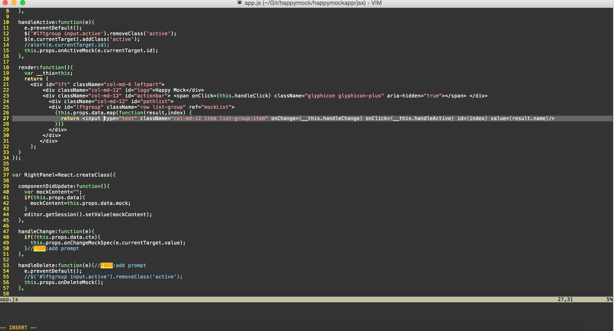

# macvim 的环境配置
mac vim 的环境配置网上有很多的样子，小猿我也看过看多，不过往往被那些繁复的配置项目，以及内嵌的vimscript吓倒
配置vim首先我们要清楚vim时用来派什么用的，这里我建议大家刚学vim的时候不要配置的太复杂，只要如下简单的几行就完全能满足日常的文本编辑器的作用了。

```
color desert "配置主题为 desert
syntax on "语法高亮

autocmd InsertLeave * se nocul "当退出edit模式时，反高亮当前行
autocmd InsertEnter * se cul "当进入editor模式时，高亮当前行

set smartindent "智能缩进
set autoindent "自动缩进
set confirm "当处理只读或者未保存的文件时，显示提示框
set number "显示行号
set history=50 "历史记录的容量
set hlsearch "高亮查找的关键词
set incsearch "高亮查找的关键词
set ruler "显示当前光标位置
set laststatus=2 "永远显示状态栏
set showcmd "在状态栏显示当前的运行命令
set encoding=utf-8
```
macvim 为我们预安装了很多的可选主题全部存放在

```
$ ls $VIMRUNTIME/colors
/Contents/Resources/vim/runtime/colors/blue.vim
./Contents/Resources/vim/runtime/colors/darkblue.vim
./Contents/Resources/vim/runtime/colors/default.vim
./Contents/Resources/vim/runtime/colors/delek.vim
./Contents/Resources/vim/runtime/colors/desert.vim
./Contents/Resources/vim/runtime/colors/elflord.vim
./Contents/Resources/vim/runtime/colors/evening.vim
./Contents/Resources/vim/runtime/colors/industry.vim
./Contents/Resources/vim/runtime/colors/koehler.vim
./Contents/Resources/vim/runtime/colors/macvim.vim
./Contents/Resources/vim/runtime/colors/morning.vim
./Contents/Resources/vim/runtime/colors/murphy.vim
./Contents/Resources/vim/runtime/colors/pablo.vim
./Contents/Resources/vim/runtime/colors/peachpuff.vim
./Contents/Resources/vim/runtime/colors/ron.vim
./Contents/Resources/vim/runtime/colors/shine.vim
./Contents/Resources/vim/runtime/colors/slate.vim
./Contents/Resources/vim/runtime/colors/torte.vim
./Contents/Resources/vim/runtime/colors/zellner.vim
```
当然我们可以在网上下载自己喜欢的主题，存放在上面的目录中。vimrc的配置不仅仅局限与此，我们可以参考http://amix.dk/vim/vimrc.html 来配置复杂的功能，这个在后面会给大家演示如何配置JS的编程环境，不过到目前位置我们已经有一个看上去很不错的编辑器了，不信你看：）



