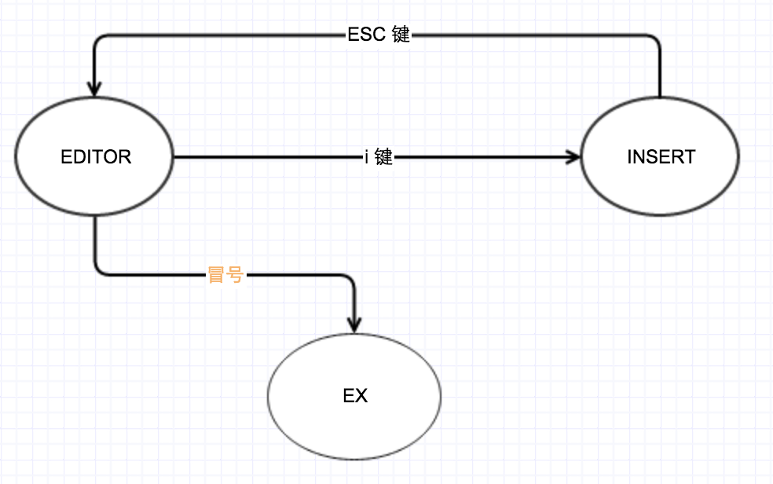

# macvim 的三种运行模式
macvim有三种运行模式：
－ editor 模式
－ insert 模式
-  ex 模式

刚刚打开macvim的时候会默认进如editor 模式，在editor模式下面，只能基于原文本进行复制，删除，剪切。当在editor 模式中按i键的时候，会进入文字插入模式，所以很多时候我们也习惯把insert模式作为editor模式的一种情况。退出insert模式可以通过“ESC”，“ESC”会把insert模式恢复到editor模式。在editor模式下通过“：”键可以进入EX模式，EX模式在执行完一条命令以后会再次回到editor模式
这里大家只需要记住，在大部分情况下，我们都是会处于editor模式和insert模式的切换过程中，可是当你需要输入一些命令，比如编译，运行，或者切换窗口命令的时候就需要呼入EX模式

