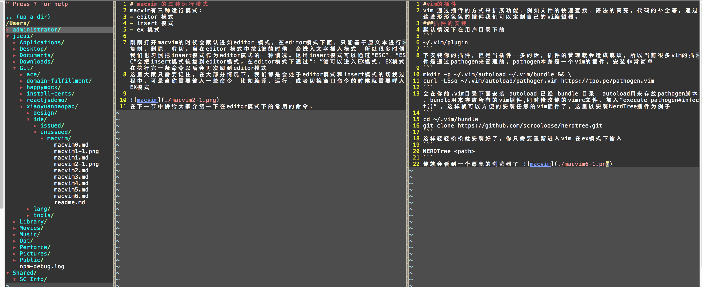

#vim的插件
vim 通过插件的方式来扩展功能，例如文件的快速查找，语法的高亮，代码的补全等，通过这些形形色色的插件我们可以定制自己的vi编辑器。
###插件的安装
默认情况下在用户目录下的
```
~/.vim/plugin
```
下安装你的插件，但是当插件一多的话，插件的管理就会造成麻烦，所以当前很多vim的插件是通过pathogen来管理的，pathogen本身是一个vim的插件，安装非常简单
```
mkdir -p ~/.vim/autoload ~/.vim/bundle && \
curl -LSso ~/.vim/autoload/pathogen.vim https://tpo.pe/pathogen.vim
```
会在你的.vim目录下面安装 autoload 已经 bundle 目录，autoload用来存放pathogen脚本，bundle用来存放所有的vim插件,同时修改你的vimrc文件，加入“execute pathogen#infect()” ，这样就可以方便的安装任意的vim插件了，这里以安装NerdTree插件为例子
```
cd ~/.vim/bundle
git clone https://github.com/scrooloose/nerdtree.git
```
这样轻轻松松就安装好了，你只需要重新进入vim 在ex模式下输入
```
NERDTree <path>
```
你就会看到一个漂亮的浏览器了 。

NERTTree 非常优秀，只要大家记住一些常用命令就可以实现飞一般的编辑速度。具体的NERDTree语法可以参考[NERDTree](https://github.com/scrooloose/nerdtree/blob/master/doc/NERD_tree.txt) ，也可以在ex模式下输入。
```
help NERD_tree
```
下一节将给大家介绍更多的优秀插件。
